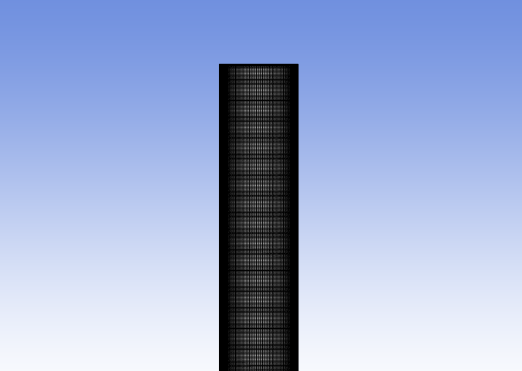
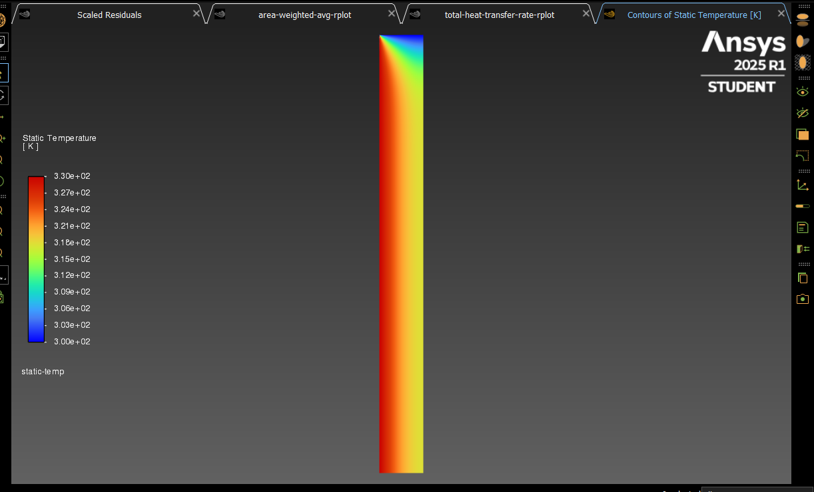
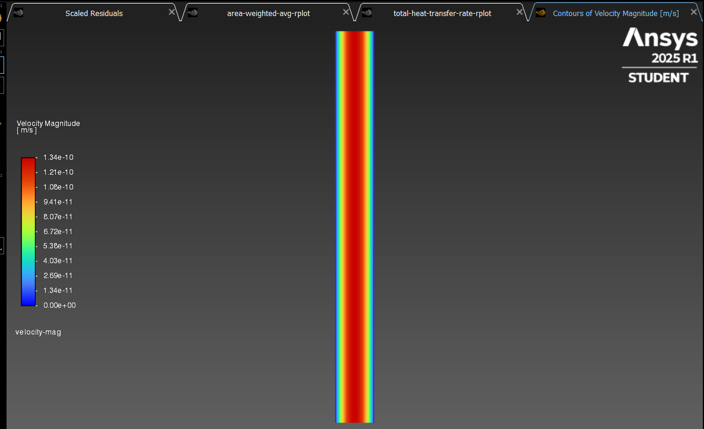
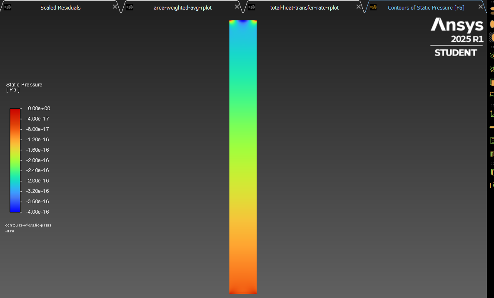
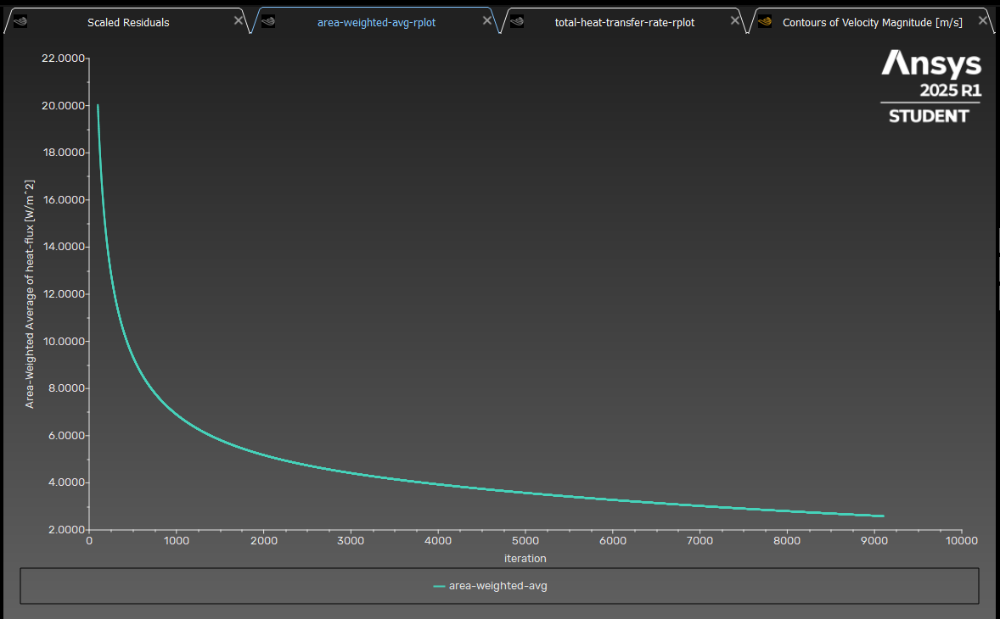
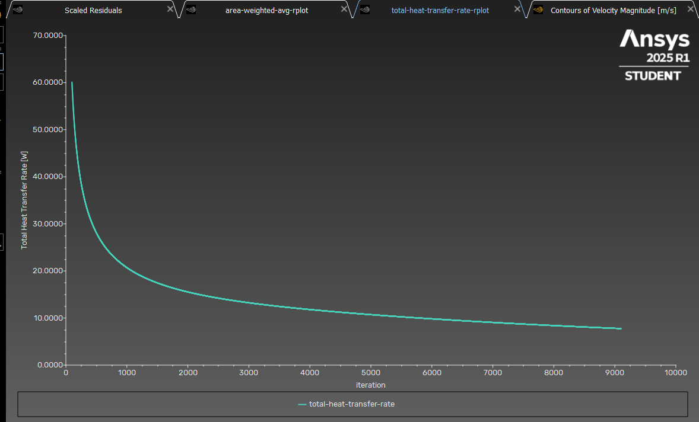
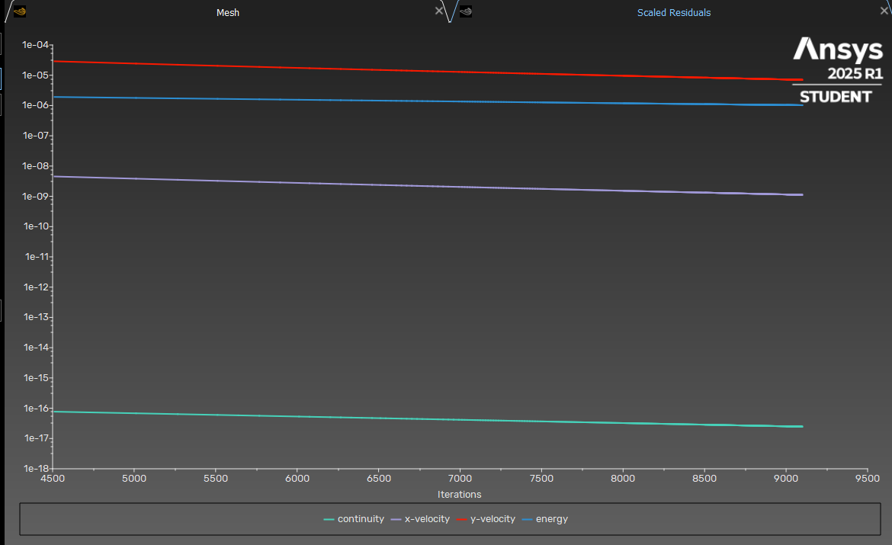

# 2D-Solar-Chimney-Analysis

# ♨️ Wall Heating CFD Simulation with ANSYS Fluent

This project analyzes steady-state heat transfer from a heated wall to a 2D air domain using **ANSYS Fluent**. It focuses on **wall heat flux behavior** and **total heat transfer rate**, simulating how a **330 K left wall** affects incoming air at **300 K**. It supports my academic path into **CFD-based renewable energy system optimization**.

---

## 🎯 Problem Definition

- **Simulation Type:** Steady-State, Laminar, 2D  
- **Software:** ANSYS Fluent  
- **Goal:** Investigate surface heat flux and total heat transfer rate  
- **Relevance:** Renewable Energy, Thermal Optimization, Graduate Research

---

## 🛠️ Setup Details

| Feature | Setting |
|--------|---------|
| **Solver** | Pressure-Based, Steady |
| **Energy Equation** | Enabled |
| **Material** | Air (Ideal Gas) |
| **Inlet** | Pressure Inlet – 300 K |
| **Outlet** | Pressure Outlet |
| **Left Wall** | Fixed Temperature – 330 K |
| **Right Wall** | Adiabatic |
| **Interior Fluid** | Defined via boolean operation (DesignModeler) |
| **Mesh** | ~**61,100 structured elements**, with bias near heated wall |

---

## 📷 Results

### 🧱 Mesh View  

### 🔥 Temperature Contour  

### 💨 Velocity Magnitude  

### 🟠 Static Pressure Contour  

### 📈 Wall Heat Flux Distribution  

### ♨️ Total Heat Transfer Rate Distribution  

### 📉 Residuals  

---

## 📊 Observations

- **Wall Heat Flux** (W/m²):  
  > Computed via *area-weighted average* of `Wall Fluxes > Total Surface Heat Flux`  
  > Decreases parabolically along the wall from ~20 W/m² to ~2 W/m²  
  > Due to thermal boundary layer development

- **Total Heat Transfer Rate** (W):  
  > Found under `Surface Integrals > Heat Transfer Rate`  
  > Decreases from ~60 W at the inlet toward ~10 W at the outlet  
  > Caused by reduction in local temperature gradient as air heats up

- **Static Pressure:**  
  > Smooth drop from inlet to outlet confirms consistent pressure-driven flow, no abnormal fluctuations.

- **Residuals:**  
  > All residuals fell below 1e-5 within ~150 iterations. Steady-state convergence was successful.

- **Total Heat Transfer Rate (Graphical Trend):**  
  > Shows parabolic decay from hot inlet zone to cooler outlet zones, due to thermal equilibrium establishment.

---

## 🔧 Engineering Takeaways

- **Mesh Biasing:** Applied toward the left (hot) wall to better resolve boundary layer effects
- **Post-Processing:** Focused on heat transfer-related results; no flow turbulence present
- **Steady Solver:** Sufficient to capture the thermal profile; no transient simulation required
- **Design Insight:** Right wall modeled as adiabatic to isolate heat transfer from one side only

---

## 🌱 Why This Project Matters

After being rejected from WUT's aerospace program, I pivoted toward a hybrid academic plan combining **renewables + fluid dynamics**.  
This simulation prepares me for potential research projects at:

> 🧠 Smart Renewable Energy Engineering @ Gdańsk University of Technology  
> 🔋 Renewable Systems + CFD + Thermal Optimization

---

## 🙋 About Me

👋 I'm a Mechanical Engineering graduate with strong interest in **CFD**, **heat transfer**, and **AI-enhanced engineering**.  
My MSc and future PhD goals revolve around simulation-driven design and energy system efficiency.  

---

## 🗂️ File List

| File | Description |
|------|-------------|
| `*.cas / *.dat` | ANSYS Fluent simulation files |
| `mesh.png` | Mesh structure |
| `temperature_contour.png` | Thermal field |
| `velocity_contour.png` | Velocity magnitude |
| `static_pressure.png` | Static pressure field |
| `wall_heat_flux.png` | Heat flux along heated wall |
| `total_heat_transfer_rate.png` | Graph of heat transfer rate drop |
| `residuals.png` | Convergence plot |
| `README.md` | This documentation |

---

## 🧪 MATLAB Note

Analytical validation using MATLAB was skipped. Fluent’s built-in outputs for both **average flux** and **total rate** reliably captured expected physical behavior. Results reflect correct **boundary layer growth** and associated heat transfer trends.

