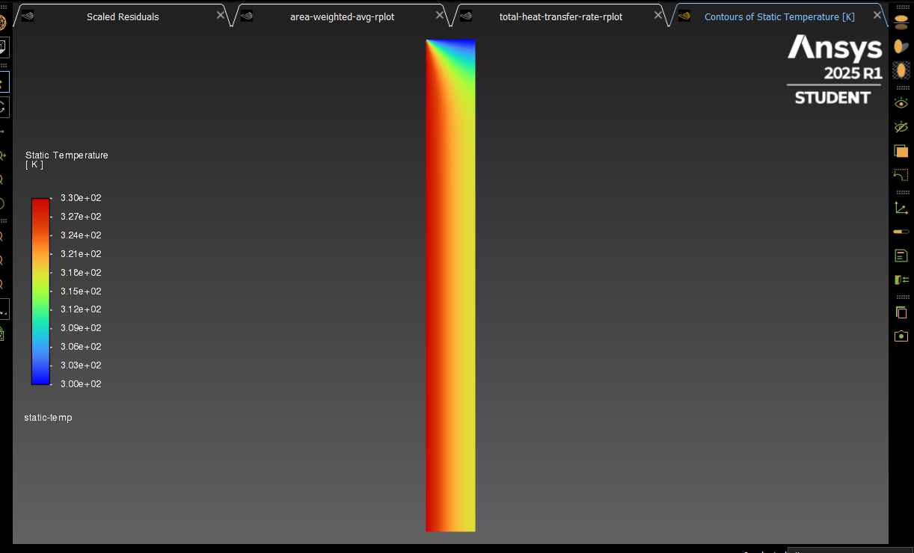
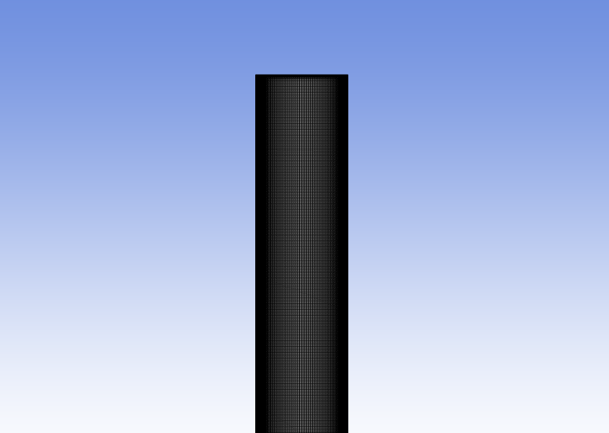
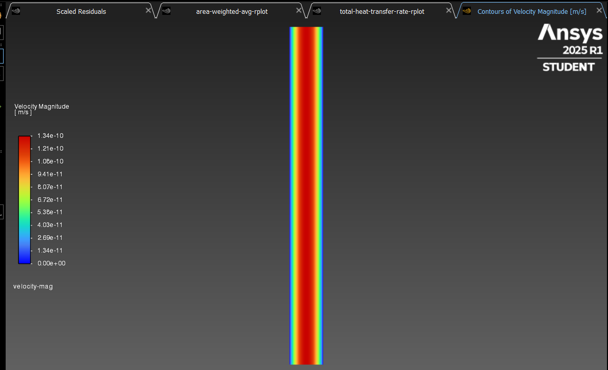
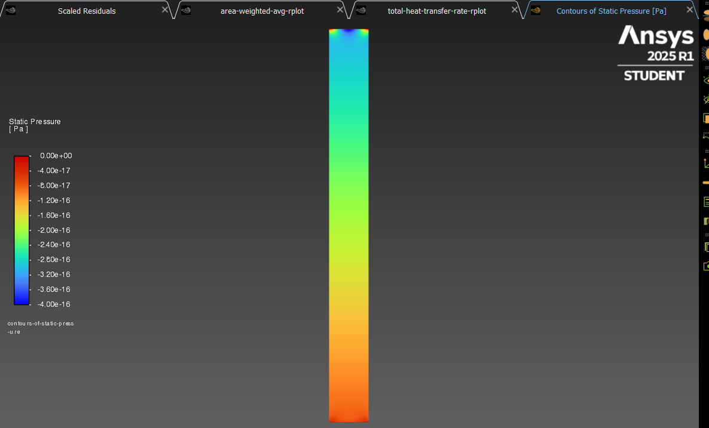
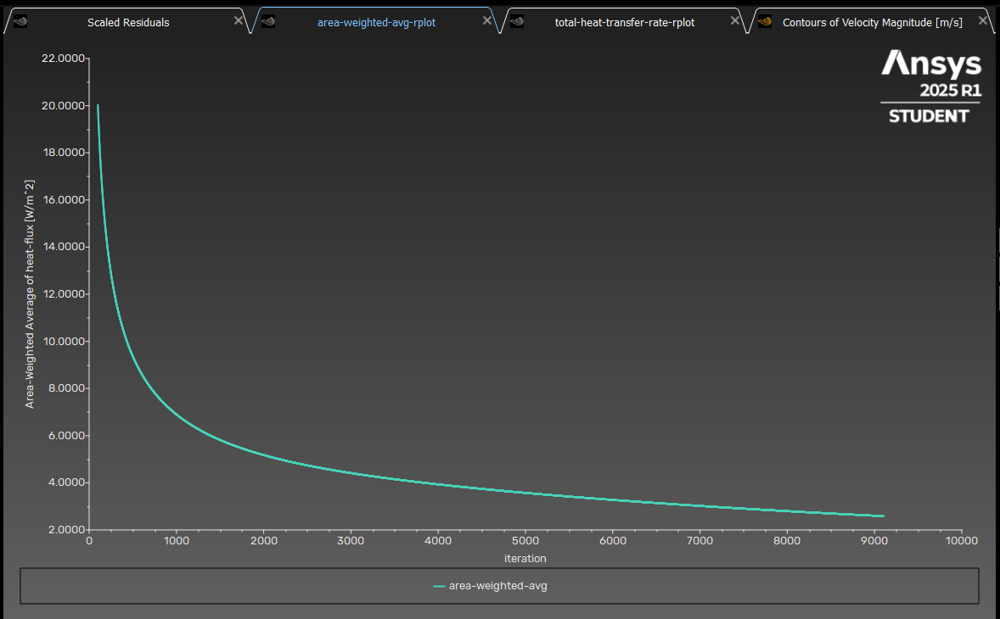
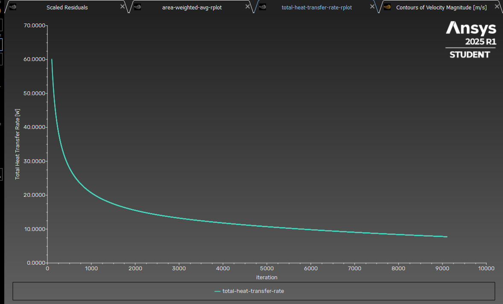
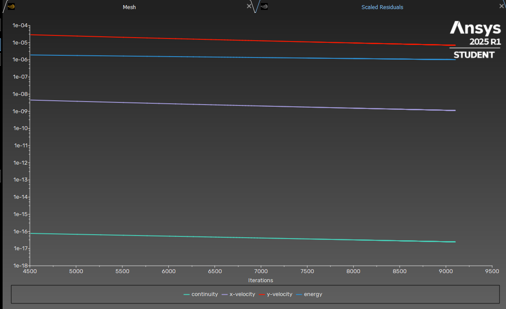

# 2D Solar Chimney: Heated-Wall Channel Flow

**Steady 2D CFD analysis in ANSYS Fluent of heat transfer from a heated (solar-absorbing) wall to air flowing through a channel. The focus is on the development of the thermal boundary layer, the wall heat flux and the total heat transfer rate.**

---

## Problem Definition

A solar chimney drives air along a wall heated by solar radiation. This model captures that wall-to-air heat transfer in a 2D channel. The left wall is held at 330 K and air enters at 300 K.

## Setup

| Item | Setting |
|---|---|
| **Solver** | Pressure-based, steady, laminar |
| **Energy equation** | On |
| **Fluid** | Air, ideal gas |
| **Inlet** | Pressure inlet, 300 K |
| **Outlet** | Pressure outlet |
| **Left wall** | Fixed temperature, 330 K (heated absorber) |
| **Right wall** | Adiabatic |
| **Fluid domain** | Created with a Boolean operation in DesignModeler |
| **Mesh** | ≈ 61,100 structured cells, biased towards the heated wall |

---

## Results

| Velocity magnitude | Static pressure |
|:---:|:---:|
|  |  |

| Wall heat flux | Total heat transfer rate |
|:---:|:---:|
|  |  |

### Observations

- **Wall heat flux** (area-weighted *Total Surface Heat Flux*) falls from about 20 W/m² to about 2 W/m² along the heated wall. The thermal boundary layer grows and the wall-normal temperature gradient drops.
- **Heat transfer rate** (*Surface Integrals → Heat Transfer Rate*) drops from about 60 W near the inlet to about 10 W towards the outlet, because the air warms up and the driving temperature difference shrinks.
- **Static pressure** falls smoothly from inlet to outlet, with no unphysical oscillations.
- **Convergence:** all residuals fell below 10⁻⁵ within about 150 iterations.

### Next steps

- Turn on gravity with the Boussinesq model so that the flow is truly **buoyancy-driven** (natural draft).
- Replace the fixed wall temperature with a **solar heat flux** boundary condition.
- Compare the Nusselt number with vertical-plate natural-convection correlations.

---

## Repository Contents

| File | Description |
|---|---|
| `mesh.png` | Mesh |
| `temperature_contour.png` | Temperature field |
| `velocity_contour.png` | Velocity magnitude |
| `static_pressure.png` | Static pressure |
| `wall_heat_flux.png` | Heat flux along the heated wall |
| `total_heat_transfer_rate.png` | Heat transfer rate |
| `residuals.png` | Convergence history |

## Author

**Burak Yörükçü** · [GitHub](https://github.com/CFDBY) · burakyorukcu@outlook.com
